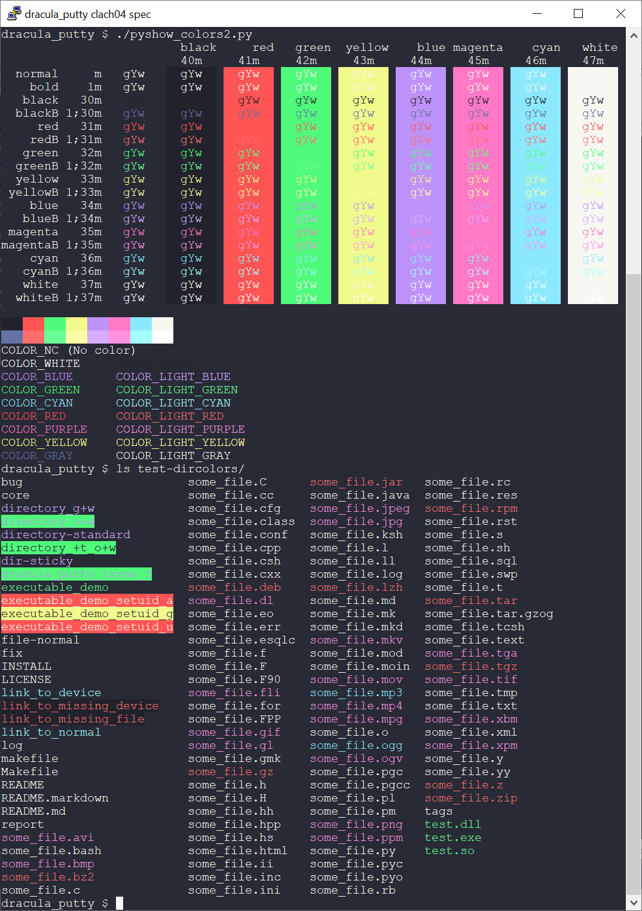

# Dracula for [PuTTY](https://www.chiark.greenend.org.uk/~sgtatham/putty/)

> A dark theme for [PuTTY](https://www.chiark.greenend.org.uk/~sgtatham/putty/).

## Install

Putty settings are stored in the Microsoft Windows Registry.

[Dracula](https://draculatheme.com/) for [PuTTY](https://www.chiark.greenend.org.uk/~sgtatham/putty/)
settings are provided as .reg files for importing into the registry.

To install:

  1. Download [dracula.reg](https://github.com/dracula/putty/raw/refs/heads/master/dracula.reg) and save to your local disk.
  2. In Windows Explorer, locate the file, then double click on it.
  3. Grant permission to import the settings.

A new "Saved Session" will now be availble in Putty named "Dracula", that inherits your regular "Default Settings" (with Dracula color overrides).

Load the "Dracula" and use Putty as per usual.

You can load "Dracula", then select "Default Settings", then hit Save to make Dracula colors your default without needing to load sessions.

## Team

This theme is maintained by the following person(s) and a bunch of [awesome contributors](https://github.com/dracula/putty/graphs/contributors).

|  |  |  |  |
| ---------------------------------------------------------------------------------------- | --------------------------------------------------------------------------------------------- | ------------------------------------------------------------------------------------| ------------------------------------------------------------------------------------|
| [Zeno Rocha](https://github.com/zenorocha)                                               | [Lucas de França](https://github.com/luxonauta)                                               | [Raffael](https://github.com/rafffael)                                              | [Chris Clark](https://github.com/clach04)                                              |

## Community

- [Twitter](https://twitter.com/draculatheme) - Best for getting updates about themes and new stuff.
- [GitHub](https://github.com/dracula/dracula-theme/discussions) - Best for asking questions and discussing issues.
- [Discord](https://draculatheme.com/discord-invite) - Best for hanging out with the community.

## License

[MIT License](./LICENSE)
